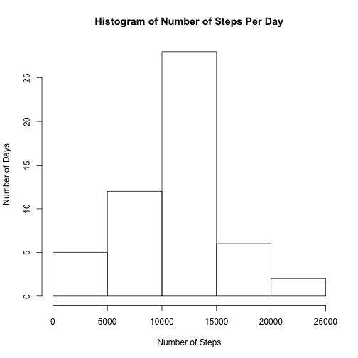
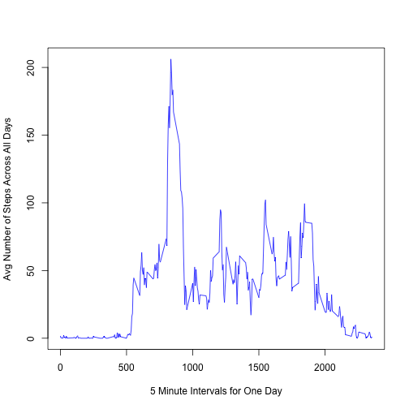
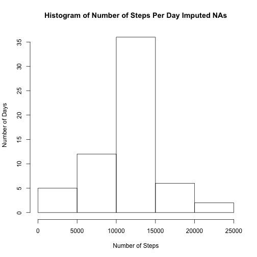
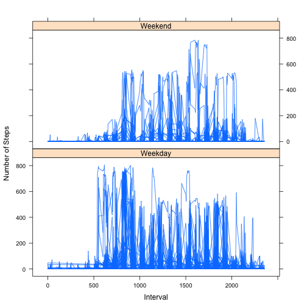

## Loading and preprocessing the data
This section loads various packages needed by the following code to analyze and process data in the 'active.csv' file. The data from this file is loaded into a data frame, and subsequently filtered as appropriate to present the data.

```r
library(data.table)
```

```
## data.table 1.9.4  For help type: ?data.table
## *** NB: by=.EACHI is now explicit. See README to restore previous behaviour.
```

```r
library(plyr)
library(stringr)
library(lattice)

# Read data to a table, load it in a data frame, and also get another frame that ignores the missing values.
activityData <- read.csv("activity.csv", header=TRUE, sep=",")
activityDataDF <- data.frame(activityData)
activityDataCompleteCases <- activityDataDF[complete.cases(activityData),]
```

## What is mean total number of steps taken per day?
For this part of the assignment, we are ignoring the missing values in the dataset.

In order to calculate the total number of steps taken per day, we aggregate them over all days.
In statistics, when you aggregate data, you replace groups of observations with summary statistics based on those observations. In R, we can achieve this easily using aggregate() method.

Next, we present a histogram of the total number of steps taken each day. 

> - Note: This is not a bar chart. 
> - With bar charts, each column represents a group defined by a variable representing a category. 
> - With histograms, each column represents a group defined by a variable representing quantity. 
> - Simply speaking, bar plot will have labels on X axis describing the categories, histogram will have a quantity represented numerically.


```r
# This line calculates the total number of steps taken per day for each day in the dataset.
aggregatedActivityData <- aggregate(. ~ date, data=activityDataCompleteCases, FUN=sum)

# Make a histogram using the 'steps' from the dataset.
hist(aggregatedActivityData$steps, main="Histogram of Number of Steps Per Day", xlab = "Number of Steps", ylab = "Number of Days")
```

 

```r
# Calculate mean and median. Ensure 'NA's are removed.
meanSteps <- mean(aggregatedActivityData$steps, na.rm = TRUE)
medianSteps <- median(aggregatedActivityData$steps, na.rm = TRUE)
```

The mean and median of the total number of steps taken per day:

```r
cat("Mean Total Number of Steps : ", meanSteps, "\n", "Median Total Number of Steps : ", medianSteps)
```

```
## Mean Total Number of Steps :  10766.19 
##  Median Total Number of Steps :  10765
```

## What is the average daily activity pattern?
Here, we make a time series plot of type = "l" using basic plot system. We use the 5-minute interval as X-axis and the average number of steps taken, averaged across all days as Y-axis. 

```r
# X axis <- 5 minute intervals for one day (0-2400)
# Y axis <- average number of steps during that interval across all days. Use only complete cases.
dtMeanForInterval <- aggregate(formula = steps ~ interval, data = activityDataCompleteCases, FUN = mean)
xLength <- length(dtMeanForInterval$interval)
yLength <- length(dtMeanForInterval$steps)
plot(dtMeanForInterval$interval, dtMeanForInterval$steps, type = "l", xlab = "5 Minute Intervals for One Day", ylab = "Avg Number of Steps Across All Days", col = "blue")
```

 

```r
dtMaxSteps <- dtMeanForInterval[which.max(dtMeanForInterval$steps),]

# This code simply formats the timestamp value to display in the answer.
dtMaxSteps$final <- str_pad(dtMaxSteps$interval, 4, pad = "0")
dtMaxSteps$final <- sub( '(?<=.{2})', ':', dtMaxSteps$final, perl=TRUE )
dtMaxSteps$timestamp <- paste(dtMaxSteps$final,":00",sep="")

cat("5-minute interval [", dtMaxSteps$final, "] contains the maximum number of steps [", dtMaxSteps$steps, "] when number of steps are averaged across all days." )
```

```
## 5-minute interval [ 08:35 ] contains the maximum number of steps [ 206.1698 ] when number of steps are averaged across all days.
```

## Imputing missing values
When creating the histogram in Question 1, we used the dataset after removing the missing values i.e. we removed NAs. The presence of missing data may introduce bias into some calculations or summaries of the data. A simple example of this would be calculating mean with NA values will always result in the outcome 'NA'.

```r
# Here, we count the total number of NA values in 'steps' column. The other two columns do not have any NAV values.
missingDataCount <- sum(is.na(activityData$steps))
# Note, if we take a count of all complete cases and subtract it from the total number of records in original dataset, we still get the same result.
cat("The total number of missing values in the dataset (i.e. the total number of rows with NAs) [", missingDataCount, "].")
```

```
## The total number of missing values in the dataset (i.e. the total number of rows with NAs) [ 2304 ].
```

Next, we devise a simple strategy to impute the data i.e. to fill in all of the missing values in the dataset. 
The strategy is to replace the missing value with the mean for that 5-minute interval across all days.

```r
# Get the mean values for each 5 minute time interval across all days.
dtMeanForInterval <- aggregate(formula = steps ~ interval, data = activityData, FUN = mean)

# This is the golden code that replaces each NA value in a given interval with the mean value of that interval across all days.
activityData$steps <- ifelse(is.na(activityData$steps), dtMeanForInterval$steps[match(activityData$interval, dtMeanForInterval$interval)], activityData$steps)
```

Now, we have a new dataset that is equal to the original dataset but with the missing data filled in i.e. with imputed values in the dataset. We make a histogram of the total number of steps taken each day with this dataset. 

```r
# Make a copy of this data for later use.
dtComplete <- activityData

# This line calculates the total number of steps taken per day for each day in the dataset.
# Note that this time we have included the imputed values in the dataset.
dtImputedCompleteData <- aggregate(formula = steps ~ date, data = activityData, FUN = sum)
hist(dtImputedCompleteData$steps, main="Histogram of Number of Steps Per Day Imputed NAs", xlab = "Number of Steps", ylab = "Number of Days")
```

 

Next, we calculate the mean and median total number of steps taken per day similar to what we did earlier. As we can see, these values do not differ much from the estimates from the first part of the assignment. 
> - When comparing the mean and median values with the earlier case, the impact of imputing missing data on the estimates of the total daily number of steps appears to be very small in this case. 
> - However, it is interesting to notice that when the two histograms are compared, the number of days seem to have gone up for the interval of 10,000 to 15,000.


```r
# na.rm parameter is added below only as a good coding practice and is probably needed here as the dataset should not have any NA values in the first place.
imputedMean <- mean(dtImputedCompleteData$steps, na.rm = FALSE)
imputedMedian <- median(dtImputedCompleteData$steps, na.rm = FALSE)
cat("Imputed Mean : ", imputedMean, "\n", " Imputed Median : ", imputedMedian)
```

```
## Imputed Mean :  10766.19 
##   Imputed Median :  10766.19
```

## Are there differences in activity patterns between weekdays and weekends?
For this final part of the assignment, we need to create a new factor variable in the dataset with two levels – “weekday” and “weekend” indicating whether a given date is a weekday or weekend day. 
In order to achieve this, we start by simply creating a list of all weekdays called 'WeekDaysList'. We will use this list to check against each day for each date in the dataset. 
We add a new column 'weekDays' to the dataset. This column will be set to 'Weekday' if the date falls on one of the days from our 'WeekDaysList' list.

```r
WeekDaysList <- c('Monday', 'Tuesday', 'Wednesday', 'Thursday', 'Friday')
# This line sets 'weekDays' column value for each row to either 'Weekday' or 'Weekend' depending upon whether the date falls on 
# a week day or a weekend.
dtComplete$weekDays <- ifelse(weekdays(as.Date(dtComplete$date)) %in% WeekDaysList, 'Weekday', 'Weekend')
dtMeanForInterval <- aggregate(formula = steps ~ interval, data = dtComplete, FUN = mean)

# Use the 'Weekdays' factor so that when plotting the data belonging to week days appears on one panel and the weekend data appears on second panel.
dtComplete <- transform(dtComplete, Weekdays = factor(weekDays))
```

Finally, using the 'Lattice' package, we make a time series plot of type = "l". The plot has the 5-minute interval as X-axis and the average number of steps taken, averaged across all weekday days or weekend days as y-axis.

```r
# Create a lattice time series plot using the transformed data.
xyplot( steps ~ interval | Weekdays, data = dtComplete, type ="l", xlab ="Interval", ylab="Number of Steps", layout = c(1,2))
```

 
